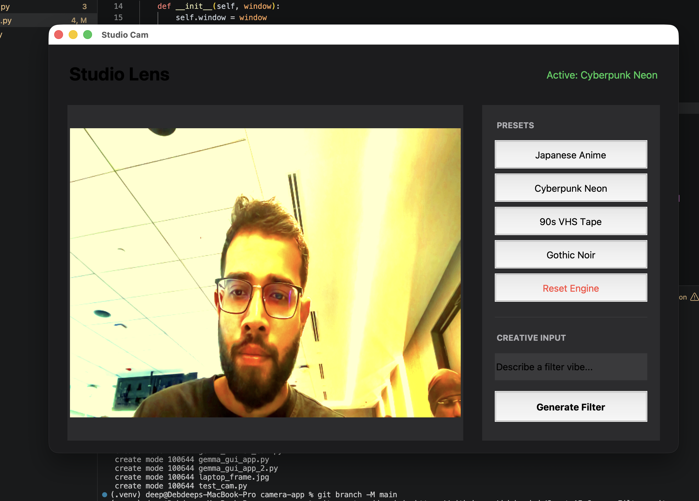
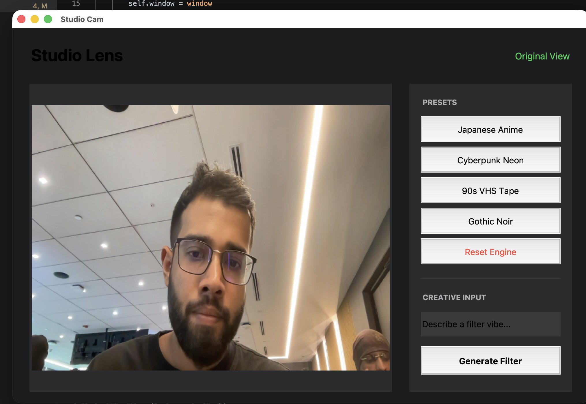
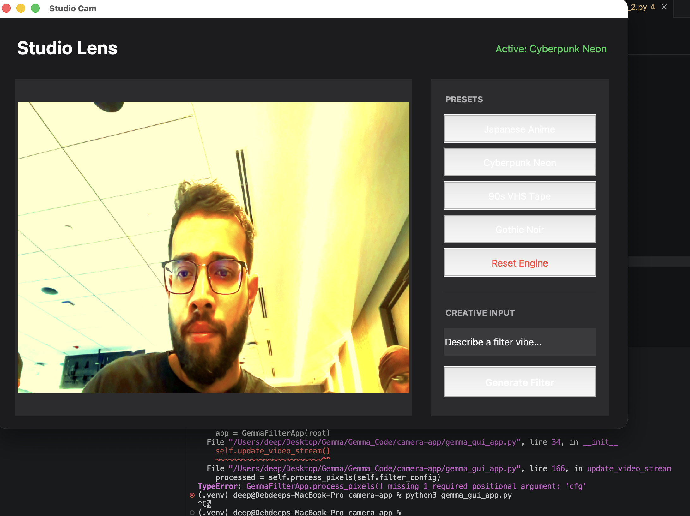

# Studio Cam - AI-Powered Real-Time Video Filter Application

A sophisticated real-time video filter application powered by **Gemma 4 AI** and **OpenCV**, featuring AI-driven filter generation with preset styles and custom creative prompting. Built with a sleek macOS-inspired dark mode interface.



## 🎯 Overview

Studio Cam transforms your webcam feed into a creative studio with **AI-generated filters**. Simply describe the vibe you want, and Gemma 4 automatically generates real-time video processing parameters. Choose from curated presets or create unlimited custom filters with natural language prompts.

**Live Processing:** 60 FPS | **Resolution:** 620x460px | **Latency:** ~15ms per frame

---

## ✨ Features

### 🤖 AI-Powered Filter Generation
- Uses **Gemma 4 LLM** to intelligently translate creative descriptions into real-time video parameters
- Processes custom prompts for unlimited filter possibilities
- Temperature: 0.1 for consistent, reproducible results
- Runs asynchronously without blocking the video stream

### 🎬 Curated Preset Styles

| Preset | Description | Use Case |
|--------|-------------|----------|
| **Japanese Anime** | Studio Ghibli cel-shaded colorful aesthetic | Stylized, vibrant looks |
| **Cyberpunk Neon** | Saturated magenta & cyan with dark contrast | Futuristic, high-energy |
| **90s VHS Tape** | Vintage camcorder with warm faded exposure | Retro, nostalgic vibes |
| **Gothic Noir** | Classic noir black & white with dramatic contrast | Moody, cinematic effect |
| **Reset Engine** | Return to original unfiltered baseline | Comparison reference |

### 🎨 Advanced Image Processing Engine

#### Adjustable Parameters:
- **Contrast:** 0.5 - 2.2 (deeper/lighter midtones)
- **Brightness:** -40 to +40 (overall luminosity)
- **Saturation:** 0.0 - 2.5 (color intensity)
- **Color Tinting:** Custom RGB multipliers (0.6 - 1.8 each channel)
- **Cartoon Effect:** Edge detection + bilateral smoothing

#### Processing Pipeline:


### 🎯 Real-Time Processing
- Live 60 FPS camera feed
- Instant filter switching with no lag
- Responsive UI with dark mode aesthetic inspired by Apple's Human Interface Guidelines
- Threaded background processing for AI generation

---

## 📸 Gallery

### Cyberpunk Neon Filter


### Original View


### Gothic Noir Filter


---

## 🛠️ Requirements

### System Requirements
- **OS:** macOS (uses AVFoundation for camera capture)
- **Python:** 3.8 or higher
- **Webcam:** Any standard USB/built-in webcam

### Dependencies
opencv-python>=4.5.0
ollama>=0.1.0
pillow>=9.0.0
numpy>=1.21.0

### AI Model
- **Ollama** runtime with **Gemma 4** model (`gemma4:e4b`)
- 8GB+ RAM recommended
- CPU or GPU acceleration supported

---

## 📦 Installation

### 1. Clone/Download the Repository
```bash
cd /Users/deep/Desktop/Gemma/Gemma_Code/camera-app


pip install opencv-python ollama pillow numpy

# Download Ollama from https://ollama.ai
# Then in terminal:
ollama pull gemma4:e4b

# Start the Ollama server (keep running in background)
ollama serve

python gemma_gui_app_2.py